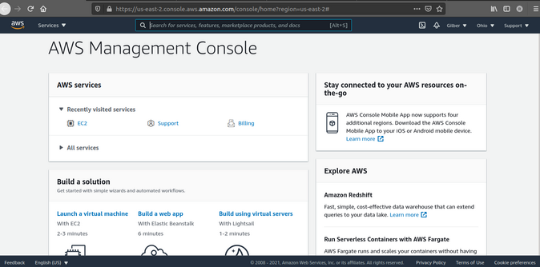
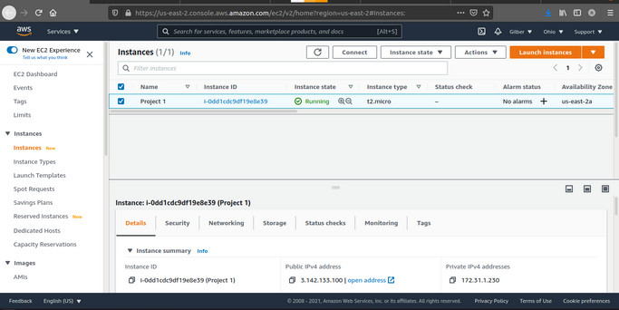

# web stack implementation (lamp) in aws

You must be really excited to start getting your hands dirty. There is a lot of projects ahead, so without any delay, lest get started.

As you kick off your career in DevOps, you will soon realise that everything you will be doing as a DevOps engineer is around software, websites, applications etc. And, there are different stack of technologies that make different solutions possible. These stack of technologies are regarded as WEB STACKS. Examples of Web Stacks include LAMP, LEMP, MEAN, and MERN stacks. As you proceed in your journey, you will be required to understand and implement all of these technology stacks. Lets have a short close up on what a Technology stack is.

## what is a technoloy stack?

A technology stack is a set of frameworks and tools used to develop a software product. This set of frameworks and tools are very specifically chosen to work together in creating a well-functioning software. They are acronymns for individual technologies used together for a specific technology product. some examples are…
- **LAMP** (Linux, Apache, MySQL, PHP or Python, or Perl)
- **LEMP** (Linux, Nginx, MySQL, PHP or Python, or Perl)
- **MERN** (MongoDB, ExpressJS, ReactJS, NodeJS)
- **MEAN** (MongoDB, ExpressJS, AngularJS, NodeJS

**WARNING:** Most of the things you will be doing at the early days may not mean a lot to you. Sometimes it may seem like you are just copying and pasting. That is absolutely fine. We want some concepts to begin to register in your sub-conscious mind, and without you realising it, you are building up skills. although, there are certain traps that will require you to troubleshoot along the way. So watch out for them in all your project implementations.

In order to complete this project you will need an AWS account and a virtual server with Ubuntu Server OS.
[AWS](https://aws.amazon.com/) is the biggest Cloud Service Provider and it offers a free tier account that we are going to leverage for our projects.
Do not focus too much on AWS itself right now, there will be a proper Cloud introduction and configuration projects later in our projects.

Right now, all we need to know is that AWS can provide us with a free virtual server called [EC2 Elastic Compute Cloud](https://aws.amazon.com/ec2/features/) for our needs.
Spinning up a new EC2 instance (an instance of a virtual server) is only a matter of a few clicks.

You can either Watch the videos below to get yourself set up.
- [AWS account setup and Provisioning an Ubuntu Server](https://www.youtube.com/watch?v=xxKuB9kJoYM&list=PLtPuNR8I4TvkwU7Zu0l0G_uwtSUXLckvh&index=6)
- [Connecting to your EC2 Instance](https://www.youtube.com/watch?v=TxT6PNJts-s&list=PLtPuNR8I4TvkwU7Zu0l0G_uwtSUXLckvh&index=7)

Or follow the instructions below.
- Register a new AWS account following this [instruction](https://aws.amazon.com/premiumsupport/knowledge-center/create-and-activate-aws-account/).

- Select your preferred region (the closest to you) and launch a new EC2 instance of t2.micro family with Ubuntu Server 20.04 LTS (HVM)

***IMPORTANT*** - save your private key (.pem file) securely and do not share it with anyone! If you lose it, you will not be able to connect to your server ever again!
- For Windows users, you will need a tool called putty to connect to your EC2 Instance. Download Putty [Here](https://www.putty.org/).
- For Mac users, you can simply open up Terminal and use the ssh command to get into the server.

