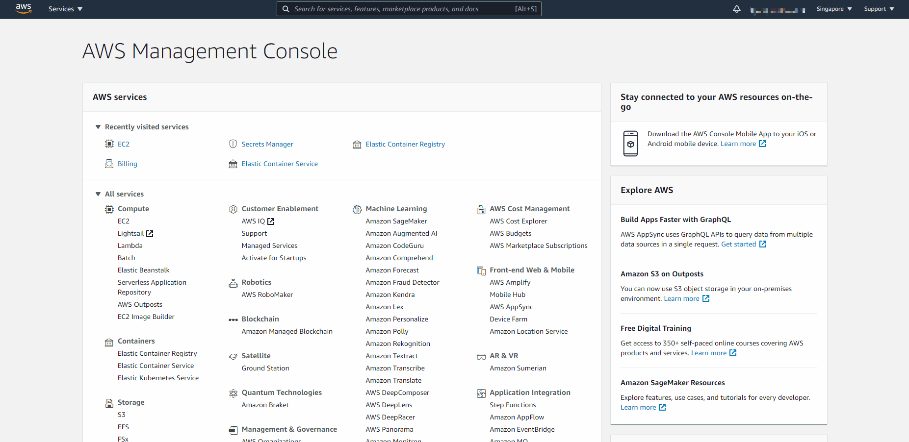
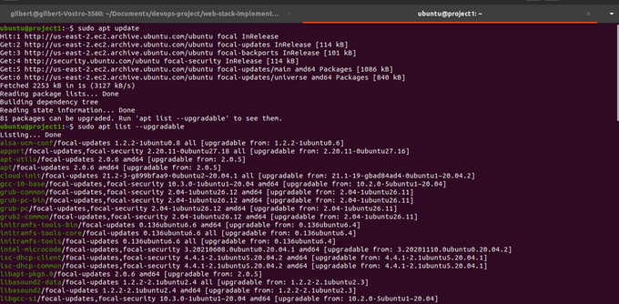
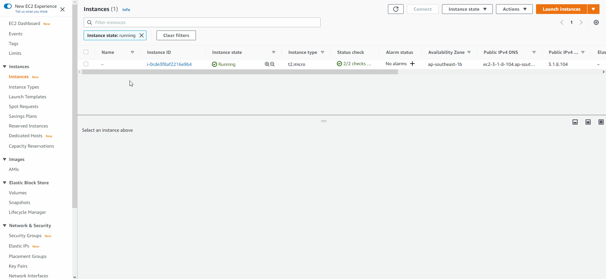

# web stack implementation (lamp) in aws

You must be really excited to start getting your hands dirty. There is a lot of projects ahead, so without any delay, lest get started.

As you kick off your career in DevOps, you will soon realise that everything you will be doing as a DevOps engineer is around software, websites, applications etc. And, there are different stack of technologies that make different solutions possible. These stack of technologies are regarded as WEB STACKS. Examples of Web Stacks include LAMP, LEMP, MEAN, and MERN stacks. As you proceed in your journey, you will be required to understand and implement all of these technology stacks. Lets have a short close up on what a Technology stack is.

## what is a technoloy stack?

A technology stack is a set of frameworks and tools used to develop a software product. This set of frameworks and tools are very specifically chosen to work together in creating a well-functioning software. They are acronymns for individual technologies used together for a specific technology product. some examples are…
- **LAMP** (Linux, Apache, MySQL, PHP or Python, or Perl)
- **LEMP** (Linux, Nginx, MySQL, PHP or Python, or Perl)
- **MERN** (MongoDB, ExpressJS, ReactJS, NodeJS)
- **MEAN** (MongoDB, ExpressJS, AngularJS, NodeJS

**WARNING:** Most of the things you will be doing at the early days may not mean a lot to you. Sometimes it may seem like you are just copying and pasting. That is absolutely fine. We want some concepts to begin to register in your sub-conscious mind, and without you realising it, you are building up skills. although, there are certain traps that will require you to troubleshoot along the way. So watch out for them in all your project implementations.

In order to complete this project you will need an AWS account and a virtual server with Ubuntu Server OS.
[AWS](https://aws.amazon.com/) is the biggest Cloud Service Provider and it offers a free tier account that we are going to leverage for our projects.
Do not focus too much on AWS itself right now, there will be a proper Cloud introduction and configuration projects later in our projects.

Right now, all we need to know is that AWS can provide us with a free virtual server called [EC2 Elastic Compute Cloud](https://aws.amazon.com/ec2/features/) for our needs.
Spinning up a new EC2 instance (an instance of a virtual server) is only a matter of a few clicks.

You can either Watch the videos below to get yourself set up.
- [AWS account setup and Provisioning an Ubuntu Server](https://www.youtube.com/watch?v=xxKuB9kJoYM&list=PLtPuNR8I4TvkwU7Zu0l0G_uwtSUXLckvh&index=6)
- [Connecting to your EC2 Instance](https://www.youtube.com/watch?v=TxT6PNJts-s&list=PLtPuNR8I4TvkwU7Zu0l0G_uwtSUXLckvh&index=7)

Or follow the instructions below.
- Register a new AWS account following this [instruction](https://aws.amazon.com/premiumsupport/knowledge-center/create-and-activate-aws-account/).

- Select your preferred region (the closest to you) and launch a new EC2 instance of t2.micro family with Ubuntu Server 20.04 LTS (HVM)

***IMPORTANT*** - save your private key (.pem file) securely and do not share it with anyone! If you lose it, you will not be able to connect to your server ever again!
- For Windows users, you will need a tool called putty to connect to your EC2 Instance. Download Putty [Here](https://www.putty.org/).
- For Mac users, you can simply open up Terminal and use the ssh command to get into the server.

**IMPORTANT NOTICE** - Both Putty and ssh use the SSH protocol to establish connectivity between computers. It is the most secure protocol because it uses crypto algorithms to encrypt the data that is transmitted - it uses TCP port 22 which is open for all newly created EC2 intances in AWS by default. Most of these terminologies will make more sense to you as you proceed. So for now, if nothing makes sense, just ignore. But be assured that the information is already registered in your sub-conscious mind. So it will become useful to you soon.
The process to connect to the virtual server is different between Windows and Mac. So lets take a quick tour.

**(Windows)** - Connecting to EC2 using Putty.

Remember the private key your downloaded from AWS while provisioning the server? It is a PEM file format. You can open it up to see the content and have a glimpse of what a PEM file looks like. Since Putty does not support .pem files - we must convert our private key (PEM format) into another file format called .ppk. We will need another tool to do that - using [PuttyGen](https://www.puttygen.com/)

Once the conversion is complete and we have our .ppk file that Putty supports, we have everything we need to connect to our EC2 instance. Here is our checklist below.
- Public IP address
- ‘ubuntu’ as user
- .ppk private key file

**Retrieve the Public IP address to your instance.**

Copy EC2 Public IP address
**Paste the public IP, load the private key and connect.**

Connect to EC2 via Putty
(**Macbook**) Connecting to EC2 using the terminal
- The terminal is already installed by default. You just need to open it up.
- You do not need to convert to a .ppk file. Just use the same key as downloaded from AWS.
- Change directory into the loacation where your PEM file is. Most likely will be in the Downloads folder
cd ~/Downloads

**IMPORTANT** - Anywhere you see these anchor tags **< >** , going forward, it means you will need to replace the content in there with values specific to your situation. For example, if we need you to replace the name you have saved the private key on your machine, we will write something like **< private-key-name >**.
f the private key you downloaded was named **my-private-key.pem** simply remove the anchor tags and insert **my-private-key.pem** in the command you are required to execute. Lets try this and follow the instructions below to get some work done.

- Change premissions for the private key file (.pem), otherwise you can get an error “Bad permissions”
sudo chmod 0400 <private-key-name>.pem
- Connect to the instance by running
ssh -i <private-key-name>.pem ubuntu@<Public-IP-address>

Congratulations! You have just created your very first Linux Server in the Cloud and our set up looks like this now: (You are the client)

Connect to EC2 via SSH
Please read information about AWS [free tier limits](https://aws.amazon.com/free/?all-free-tier.sort-by=item.additionalFields.SortRank&all-free-tier.sort-order=asc) and make sure that you **STOP** your EC2 instance when you are not using it.

Stop EC2
All we need to know right now is that we can use 750 hours (31.25 days) of t2.micro server per month for the first 12 months **FOR FREE.**
You can launch and stop new instances when you need to, but by default there is a soft-limit of maximum 5 running instances at the same time. In our first projects we will be using only 1 running instance at a time. When you stop an instance - it stops consuming available hours.
Note that every time you stop and start your EC2 instance - you will have a **new IP address**, it is normal behavior, so do not forget to update your SSH credentials when you try to connect to your EC2 server.
Let us move on and configure our EC2 machine to serve a Web server!

### What exactly is Apache?
[Apache](https://httpd.apache.org/) HTTP Server is the most widely used web server software. Developed and maintained by Apache Software Foundation, Apache is an open source software available for free. It runs on 67% of all webservers in the world. It is fast, reliable, and secure. It can be highly customized to meet the needs of many different environments by using extensions and modules. Most WordPress hosting providers use Apache as their web server software. However, websites and other applications can run on other web server software as well. Such as [Nginx](https://www.nginx.com/), [Microsoft’s IIS](https://www.iis.net/), etc.

The Apache web server is among the most popular web servers in the world. It’s well documented, has an active community of users, and has been in wide use for much of the history of the web, which makes it a great default choice for hosting a website.

Install Apache using Ubuntu’s package manager [‘apt’](https://en.wikipedia.org/wiki/APT_(software)):

- update a list of packages in package manager:
sudo apt update

- run apache2 package installation:
sudo apt install apache2

To verify that apache2 is running as a Service in our OS, use following command:
sudo systemctl status apache2

If it is green and running, then you did everything correctly - you have just launched your first Web Server in the Clouds!

Before we can receive any traffic by our Web Server, we need to open TCP port 80 which is the default port that web browsers use to access web pages on the Internet.

As we know, we have TCP port 22 open by default on our EC2 machine to access it via SSH, so we need to add a rule to EC2 configuration to open inbound connection through port 80:

Open inbound port 80

Our server is running and we can access it locally and from the Internet (Source 0.0.0.0/0 means ‘from any IP address’).

First, let us try to check how we can access it locally in our Ubuntu shell, run:

 curl http://localhost:80
 or
 curl http://127.0.0.1:80

 

 These 2 commands above actually do pretty much the same - they use ‘curl’ command to request our Apache HTTP Server on port 80 (actually you can even try to not specify any port - it will work anyway). The difference is that: in the first case we try to access our server via [DNS name](https://en.wikipedia.org/wiki/Domain_Name_System) and in the second one - by IP address (in this case IP address 127.0.0.1 corresponds to DNS name ‘localhost’ and the process of converting a DNS name to IP address is called “resolution”). We will touch DNS in further lectures and projects.

As an output you can see some strangely formatted test, do not worry, we just made sure that our Apache web service responds to ‘curl’ command with some payload.

Now it is time for us to test how our Apache HTTP server can respond to requests from the Internet. Open a web browser of your choice and try to access following url

http://**your public address**:80 

If you see following page, then your web server is now correctly installed and accessible through your firewall.

Apache Ubuntu Default Page

Another way to retrieve your Public IP address, other than to check it in AWS Web console, is to use following command:

curl -s http://169.254.169.254/latest/meta-data/public-ipv4

The URL in browser shall also work if you do not specify port number since all web browsers use port 80 by default.

In fact, it is the same content that you previously got by ‘curl’ command, but represented in nice [HTML](https://en.wikipedia.org/wiki/HTML) formatting by your web browser.

#### Installing MySQL
Now that you have a web server up and running, you need to install a [Database Management System (DBMS)](https://en.wikipedia.org/wiki/Database#Database_management_system) to be able to store and manage data for your site in a [relational database](https://en.wikipedia.org/wiki/Relational_database). [MySQL](https://www.mysql.com/) is a popular relational database management system used within PHP environments, so we will use it in our project.

Again, use ‘apt’ to acquire and install this software:
sudo apt install mysql-server

When prompted, confirm installation by typing Y, and then ENTER.

When the installation is finished, it’s recommended that you run a security script that comes pre-installed with MySQL. This script will remove some insecure default settings and lock down access to your database system. Start the interactive script by running:

